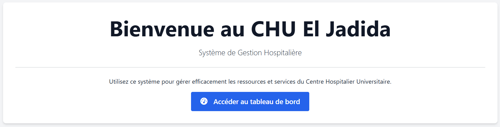
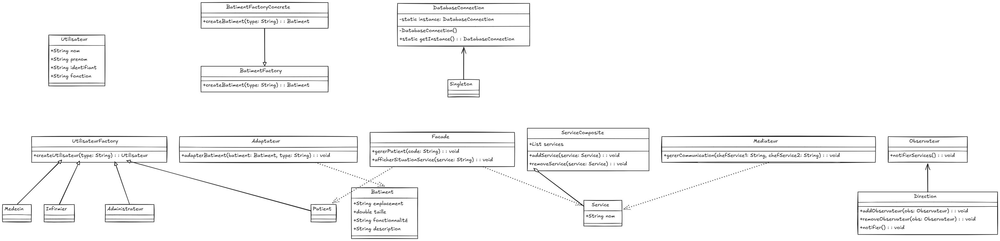
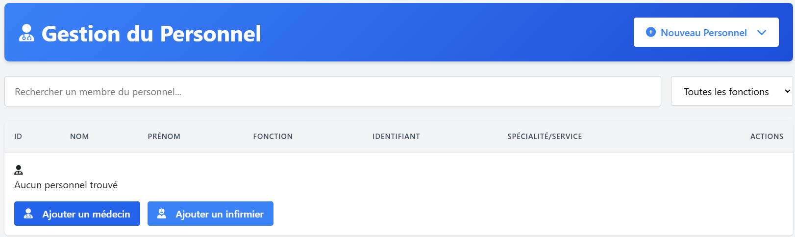
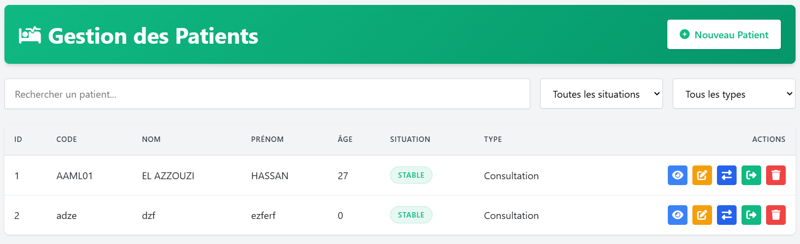
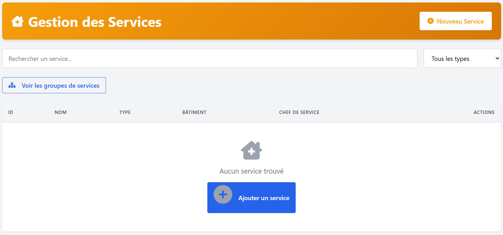
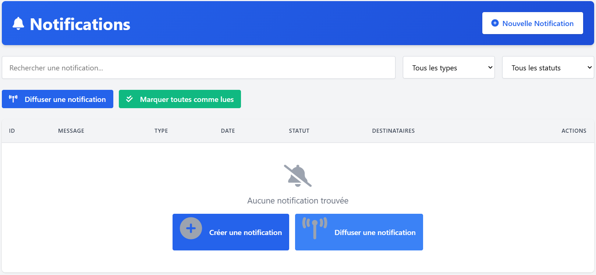

# CHU Hospital Management System

## Overview

The CHU Hospital Management System is a comprehensive web-based application. This system provides an integrated solution for managing hospital buildings, personnel, patients, services, and notifications, enabling efficient hospital administration and improved patient care.

## Technologies Used

- **Backend**: Java 17, Spring Boot 3.2.3
- **Frontend**: Thymeleaf, HTML5, CSS3, JavaScript
- **Database**: MySQL 8
- **Build Tool**: Maven
- **Design Patterns**: Factory Method, Abstract Factory, Adapter, Composite, Mediator, Facade, Observer

## System Architecture

The application follows a layered architecture:

- **Presentation Layer**: Thymeleaf templates, CSS, JavaScript
- **Controller Layer**: Spring MVC controllers
- **Service Layer**: Business logic and service implementations
- **Repository Layer**: Data access using Spring Data JPA
- **Domain Layer**: Entity classes representing the domain model

## Design Patterns Implementation

The system implements several design patterns to ensure maintainability, extensibility, and code reusability:



- **Factory Method**: Used for creating different types of buildings (Administration, Laboratory, Emergency)
- **Abstract Factory**: Used for creating different types of users (Doctors, Nurses, Administrators, etc.)
- **Adapter**: Used to adapt rooms for different purposes (e.g., converting emergency rooms to surgery rooms)
- **Composite**: Used for organizing services in hierarchical structures
- **Mediator**: Used for communication between department heads
- **Facade**: Used to simplify patient management operations
- **Observer**: Used for notification system between services


## Features and Modules

### 1. Building Management

- Add, edit, view, and delete hospital buildings
- Categorize buildings by type (Administration, Laboratory, Emergency, etc.)
- Track building details (location, size, functionality)

### 2. Personnel Management

- Manage different types of personnel (Doctors, Nurses, Administrators, Directors, Support Staff)
- Track personnel details and specializations
- Assign personnel to services and departments

### 3. Patient Management

- Register and manage patient information
- Track patient medical status
- Transfer patients between sections
- Process patient discharge

### 4. Service Management

- Create and manage hospital services
- Assign services to buildings
- Assign personnel as service heads
- Adapt services for different purposes

### 5. Notification System

- Send notifications to personnel
- Broadcast important announcements
- Track notification status

### 6. Section Management
- Organize patients into medical sections
- Assign doctors to sections
- Track section capacity and occupancy


## Installation and Setup

### Prerequisites
- Java 17 or higher
- MySQL 8.0 or higher
- Maven 3.6 or higher

### Database Setup
1. Create a MySQL database named `chu_db`
2. Configure database connection in `src/main/resources/application.properties`

### Building and Running the Application

#### 1. Clone the Repository
```bash
git clone https://github.com/ElazzouziHassan/chu-system.git
cd chu-management
```

#### 2. Configure Development Environment
- Ensure Java 17 is installed and configured:
  ```bash
  java -version
  ```
- Ensure Maven is installed:
  ```bash
  mvn -version
  ```
- Install MySQL 8.0 if not already installed

#### 3. Configure Database
- Create a MySQL database:
  ```sql
  CREATE DATABASE chu_db CHARACTER SET utf8mb4 COLLATE utf8mb4_unicode_ci;
  ```
- Create a database user (optional):
  ```sql
  CREATE USER 'chu_user'@'localhost' IDENTIFIED BY 'your_password';
  GRANT ALL PRIVILEGES ON chu_db.* TO 'chu_user'@'localhost';
  FLUSH PRIVILEGES;
  ```
- Update database configuration in `src/main/resources/application.properties`:
  ```properties
  spring.datasource.url=jdbc:mysql://localhost:3306/chu_db?createDatabaseIfNotExist=true
  spring.datasource.username=chu_user
  spring.datasource.password=your_password
  ```

#### 4. Build the Application
```bash
  ./mvnw clean install
```

#### 5. Run the Application
- Using Maven:
  ```bash
    ./mvnw spring-boot:run
  ```
- Or using the JAR file:
  ```bash
  java -jar target/chu-management-0.0.1-SNAPSHOT.jar
  ```

#### 6. Access the Application
- Open a web browser and navigate to: `http://localhost:8080`
- Default login credentials (if applicable):
  - Username: `admin`
  - Password: `admin`

#### 7. Development Tips
- Use Spring DevTools for automatic restarts during development
- Run with development profile for additional logging:
  ```bash
  mvn spring-boot:run -Dspring-boot.run.profiles=dev
  ```
- For frontend changes, refresh the browser to see updates
- For database schema changes, set `spring.jpa.hibernate.ddl-auto=update` in development

